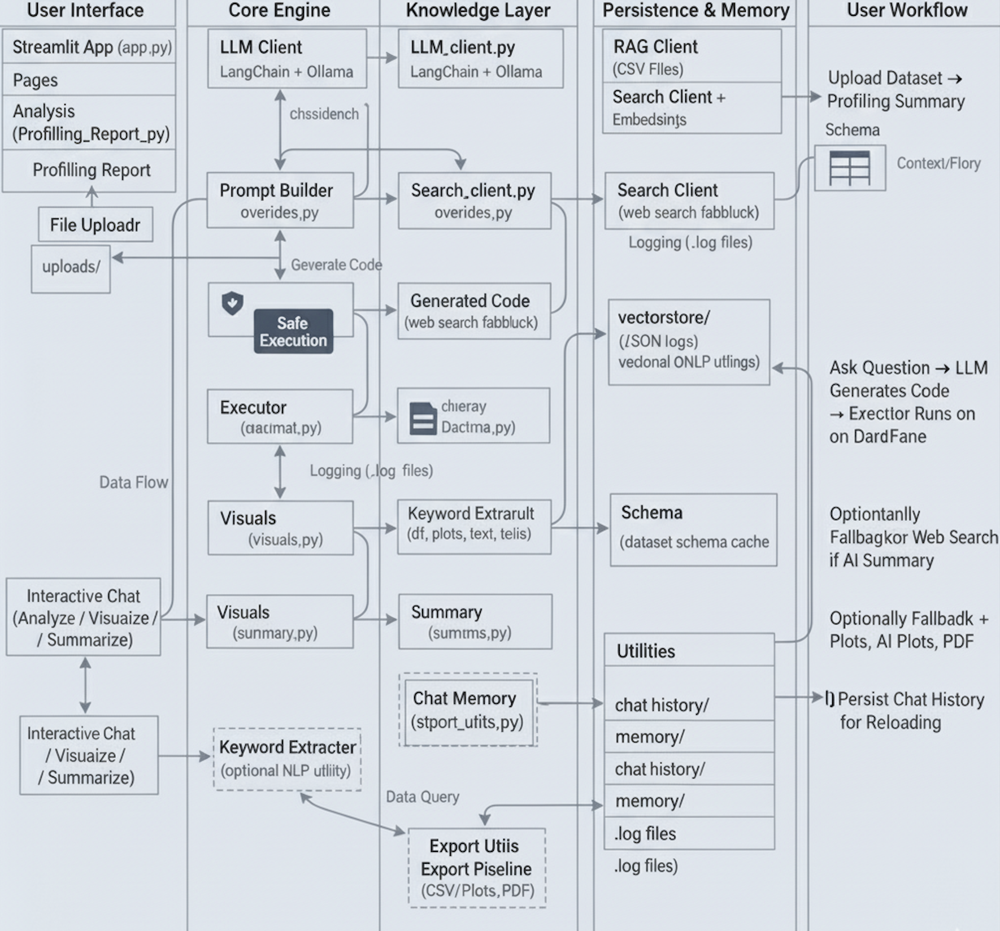
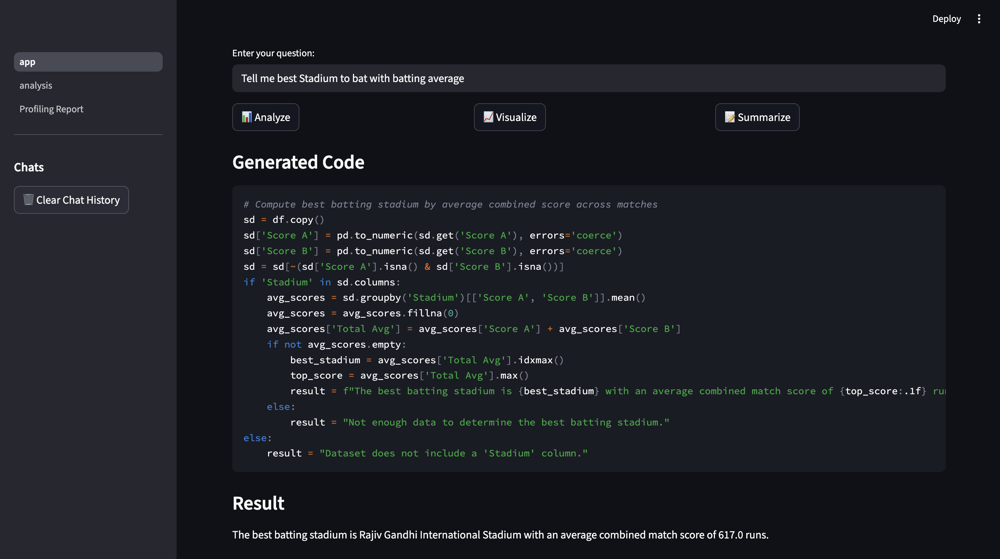
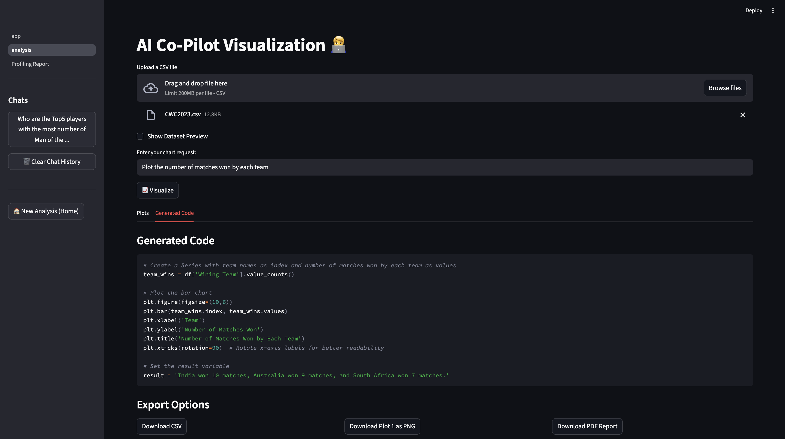
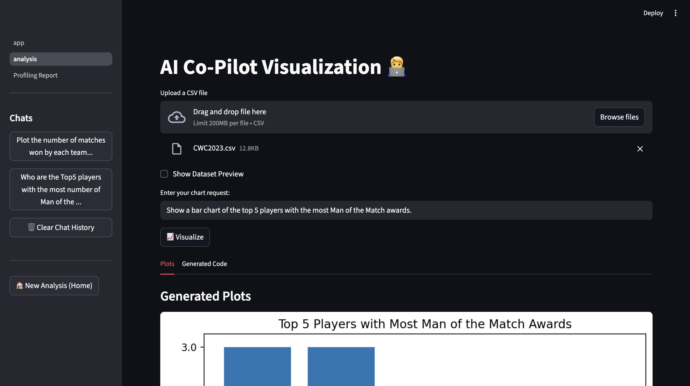
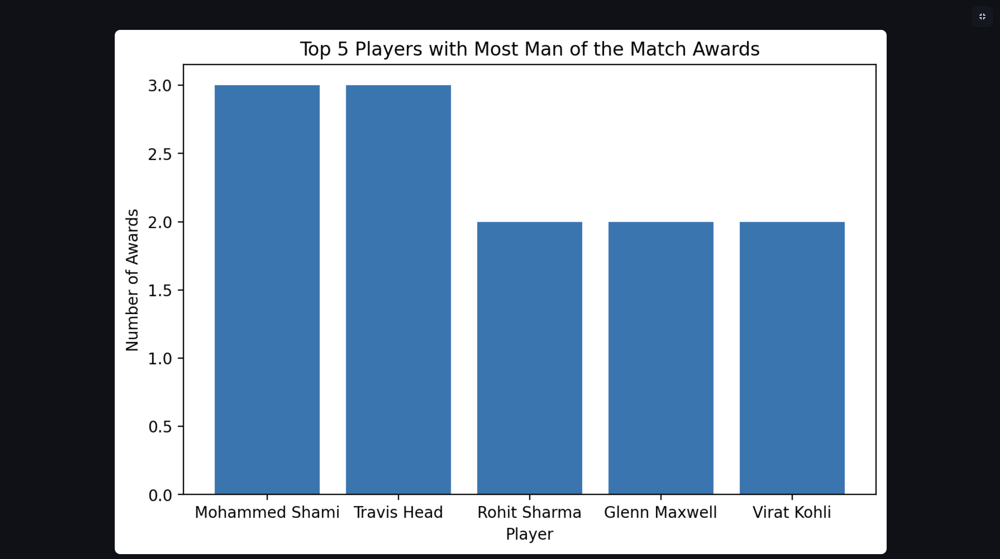
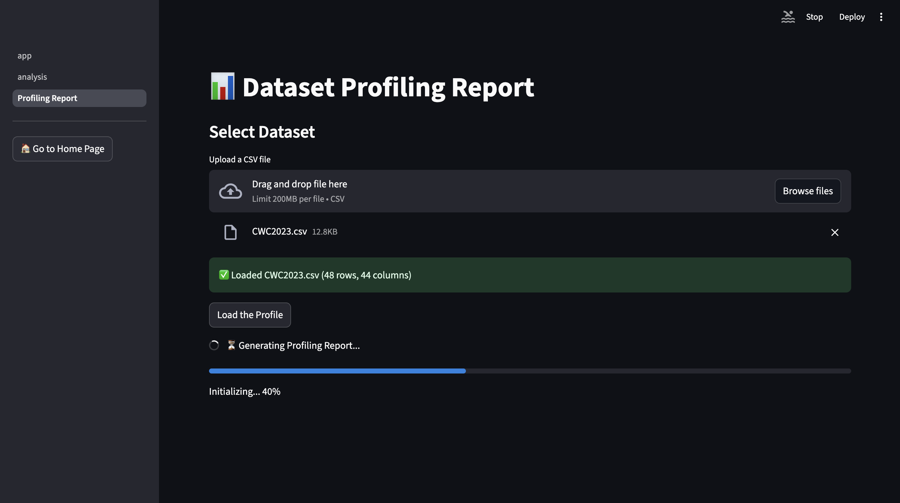
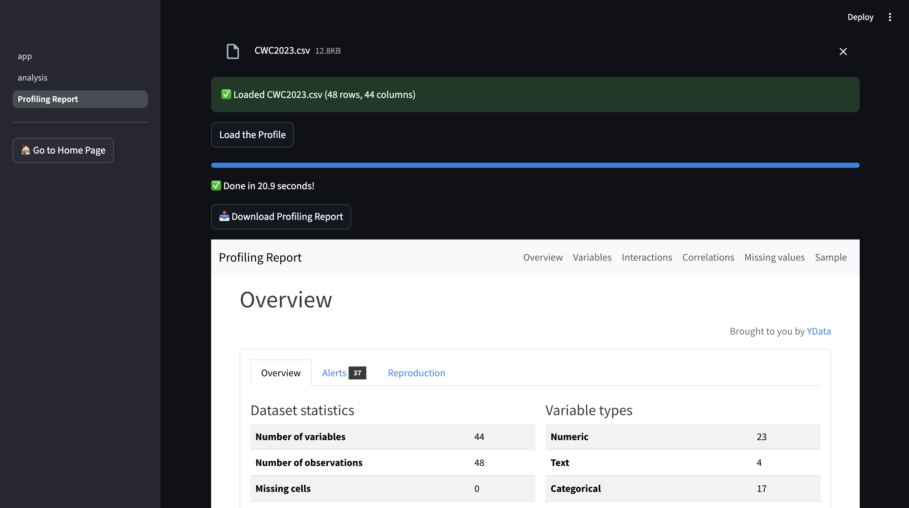
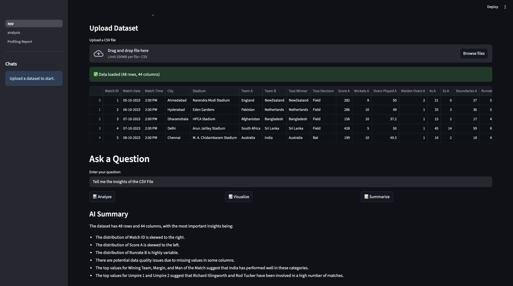

# 🤖 AI Data Analyst Agent  


> An AI-powered data analysis platform that lets you **chat with your dataset**, generate insights, build visualizations, and export professional reports — all via natural language.  

---

## 🏗️ System Architecture  



The system follows a **modular design**, ensuring maintainability and scalability:

- **Streamlit App** → User interface for dataset upload, chat, and visualization.  
- **LLM Client (LangChain + Ollama)** → Translates natural language into Python code.  
- **Executor** → Safely executes AI-generated code on the dataset.  
- **Visuals & Export Utils** → Creates plots, PDFs, and CSV outputs.  
- **Knowledge Layer** → RAG (vectorstore) + Web Search fallback for context-aware answers.  
- **Persistence & Memory** → Chat history, schema caching, and logging.  

---

## 🚀 Why This Project?

Data analysis is often slow and manual. Our **AI Agent** streamlines the process by combining **Streamlit, LangChain, and local LLMs** into a single interactive platform where you can:  

- 📂 Upload a CSV dataset  
- 💬 Ask natural language questions  
- 📊 Get automated analysis, visualizations, and summaries  
- 📑 Export results into **PDF/CSV/plots**  

This is **not a toy demo** — it’s a **feature-rich prototype approaching production quality**.  

---

## ✨ Features

- 📂 **CSV Uploads up to 100MB**  
- 💬 **Natural Language Q&A** on datasets  
- 📊 **Automatic Visualizations** (matplotlib)  
- 📝 **Summarization & Insights** (RAG + LLMs)  
- 🧹 **Data Cleaning UI** for consistency  
- 💾 **Export Options** → CSV, Plots, PDF reports  
- ⚡ **Caching** → Faster repeated queries  
- 🧠 **Persistent Chat Memory** per dataset  
- 🔎 **Web Search Fallback** for missing context  
- 📑 **Structured Logging** (`app.log`, `analysis.log`)  

---

## 🖼️ Walkthrough

### 1️⃣ Upload Dataset
> 

### 2️⃣ Chat with Data


### 3️⃣ Automated Analysis


### 4️⃣ Visualizations


### 5️⃣ Graph


### 6️⃣ Profiling Report


### 7️⃣ Report


### 8️⃣ Summary


---
## 🛠️ Tech Stack

- **Frontend** → Streamlit  
- **LLM Framework** → LangChain  
- **Local LLM** → Ollama  
- **Data Handling** → Pandas, NumPy  
- **Visualization** → Matplotlib  
- **Storage** → ChromaDB (vectorstore)  
- **Export** → PDFKit + wkhtmltopdf   
---


## ⚙️ Installation

```bash
# Clone repository
git clone https://github.com/your-username/ai-data-analyst-agent.git
cd ai-data-analyst-agent
# Create environment
conda create -n analyst_env python=3.10 -y
conda activate analyst_env
# Install dependencies
pip install -r requirements.txt
# Run App
streamlit run app.py
```
--- 
## 👤 Author
-  Syed Abdul Waheed
-  Data Science Enthusiast | Python Developer | Automation Explorer
- 📬 Connect: LinkedIn (https://www.linkedin.com/in/syed-abdul-waheed/)
- 🐙 GitHub: waheed24-03
---


