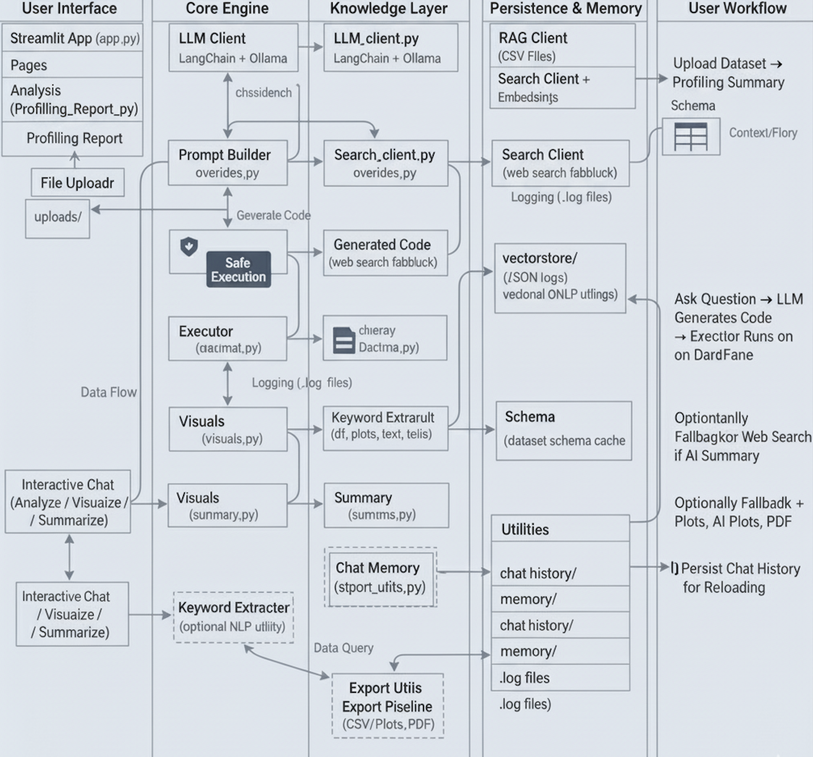
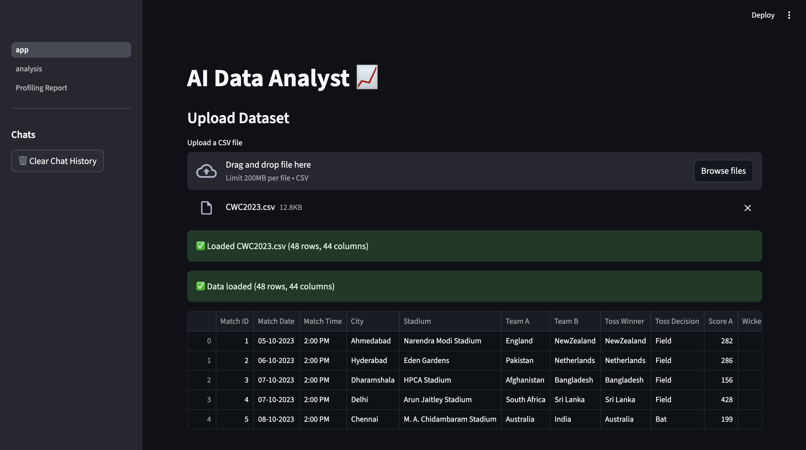
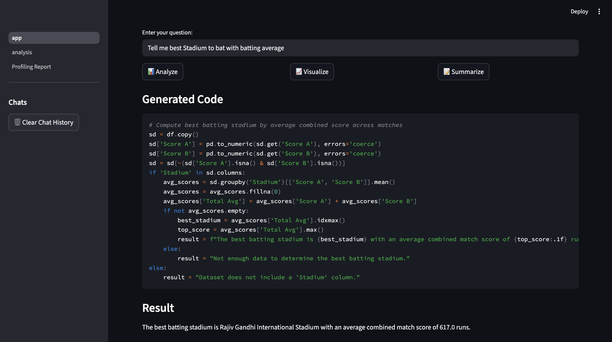
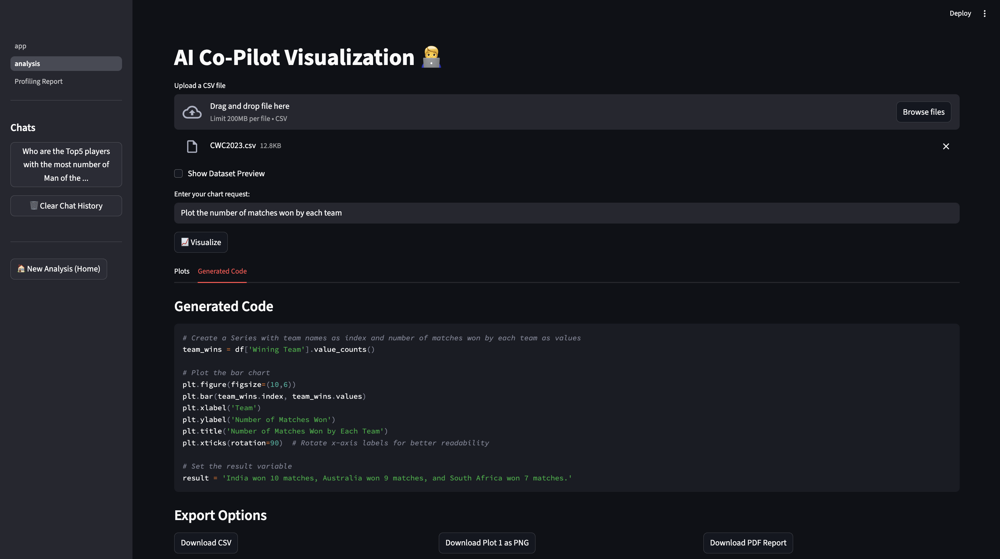
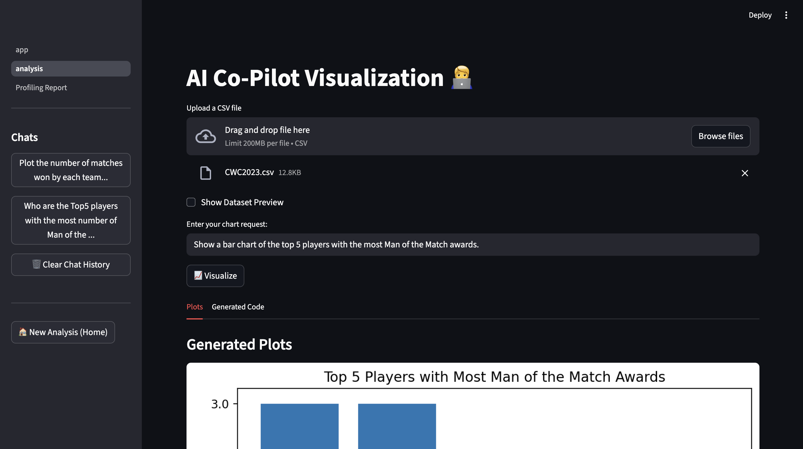
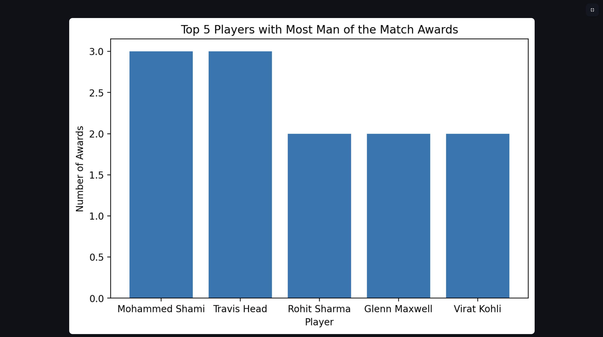
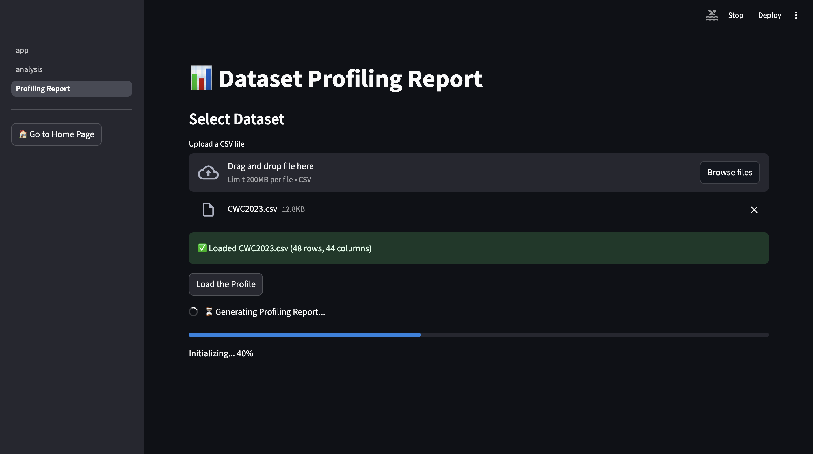
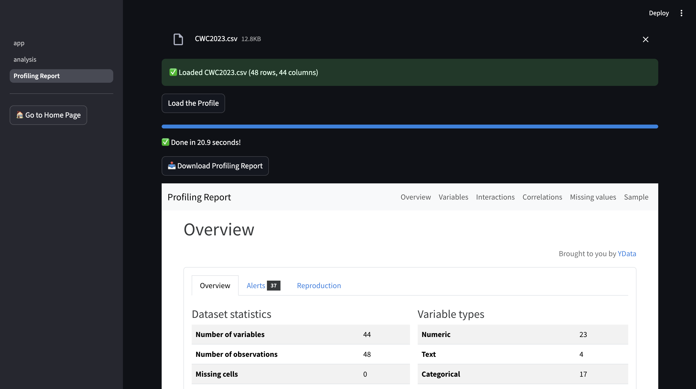
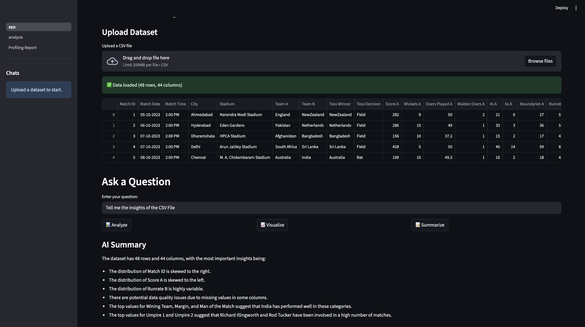

  

  <br />

  <p>
    
    
    
    
  </p>

  <h3>🤖 Your Personal Data Scientist, Powered by LLMs</h3>
  
  <p align="center">
    <i>"A conversational intelligence platform that allows you to chat with your dataset, generate visualizations on the fly, and export professional reports."</i>
  </p>
</div>

---

## 🏗️ System Architecture

The system follows a robust **modular design**, ensuring maintainability and scalability for real-world data tasks.

<div align="center">
  
</div>

<br />

| Module | Functionality |
| :--- | :--- |
| **Streamlit App** | Interactive UI for upload, chat, and visualization. |
| **LLM Engine** | **LangChain + Ollama** translates natural language into Python analysis code. |
| **Executor** | Safely executes generated code on the dataframe. |
| **Knowledge Layer** | **RAG (ChromaDB)** + Web Search fallback for context-aware answers. |
| **Persistence** | Manages Chat history, schema caching, and session memory. |

---

## 🚀 Why This Project?

Data analysis is often manual, repetitive, and requires coding skills. This **AI Agent** bridges the gap by combining **Local LLMs and Python** into a single workflow.

* **Privacy First:** Runs locally using Ollama (no data leaves your machine).
* **Not a Toy:** Handles CSVs up to **100MB**, includes error handling, and structured logging.
* **End-to-End:** From raw data upload to a downloadable PDF report.

---

## ✨ Key Features

- 📂 **Smart Ingestion**: Upload large CSV files (up to 100MB) with auto-schema detection.
- 💬 **Natural Language Querying**: Ask "What is the sales trend?" and get a coded answer.
- 📊 **Auto-Visualization**: Generates Matplotlib/Seaborn charts automatically based on queries.
- 📝 **RAG-Powered Insights**: Uses Vector Search to find semantic context within text columns.
- 💾 **Professional Exports**: Download analysis as **CSV**, **Plots**, or **PDF Reports**.
- ⚡ **Performance**: Implements **Caching** for repeated queries and persistent chat memory.
- 🔎 **Web Aware**: Fallback to Web Search if the dataset lacks specific context.

---

## 🖼️ Visual Walkthrough

<div align="center">
  <table>
    <tr>
      <td align="center"><b>1️⃣ Upload Dataset</b></td>
      <td align="center"><b>2️⃣ Chat with Data</b></td>
    </tr>
    <tr>
      <td></td>
      <td></td>
    </tr>
    <tr>
      <td align="center"><b>3️⃣ Automated Analysis</b></td>
      <td align="center"><b>4️⃣ Visualizations</b></td>
    </tr>
    <tr>
      <td></td>
      <td></td>
    </tr>
    <tr>
      <td align="center"><b>5️⃣ Graph Generation</b></td>
      <td align="center"><b>6️⃣ Profiling Report</b></td>
    </tr>
    <tr>
      <td></td>
      <td></td>
    </tr>
     <tr>
      <td align="center"><b>7️⃣ Report Export</b></td>
      <td align="center"><b>8️⃣ Summary</b></td>
    </tr>
    <tr>
      <td></td>
      <td></td>
    </tr>
  </table>
</div>

---

## 🛠️ Technology Stack

| Component | Technology | Role |
| :--- | :--- | :--- |
| **Frontend** |  | User Interface |
| **Orchestration** |  | LLM Chains & Agents |
| **Inference** |  | Local LLM Runner |
| **Data Ops** |  | Data Manipulation |
| **Vector Store** |  | RAG / Semantic Search |
| **Reporting** | `PDFKit`, `wkhtmltopdf` | PDF Generation |

---

## ⚙️ Installation & Setup

```bash
# 1. Clone the repository
git clone [https://github.com/Syed-Waheed/ai-data-analyst-agent.git](https://github.com/Syed-Waheed/ai-data-analyst-agent.git)
cd ai-data-analyst-agent

# 2. Create a virtual environment (Recommended)
conda create -n analyst_env python=3.10 -y
conda activate analyst_env

# 3. Install dependencies
pip install -r requirements.txt

# 4. Ensure Ollama is running locally
ollama serve

# 5. Run the Application
streamlit run app.py

```
## 👤 Author

<div align="left">
  

  <strong>Syed Abdul Waheed</strong><br/>
  <em>Data Science Enthusiast | Python Developer | Automation Explorer</em>

  Focused on building concepts rather than memorizing syntax. Actively working on strengthening practical implementation skills in AI & ML.

  <br /><br />

  <a href="https://www.linkedin.com/in/syed-abdul-waheed/">
    
  </a>

  <a href="https://github.com/Syed-Waheed">
    
  </a>
</div>

<br clear="left"/>

---
